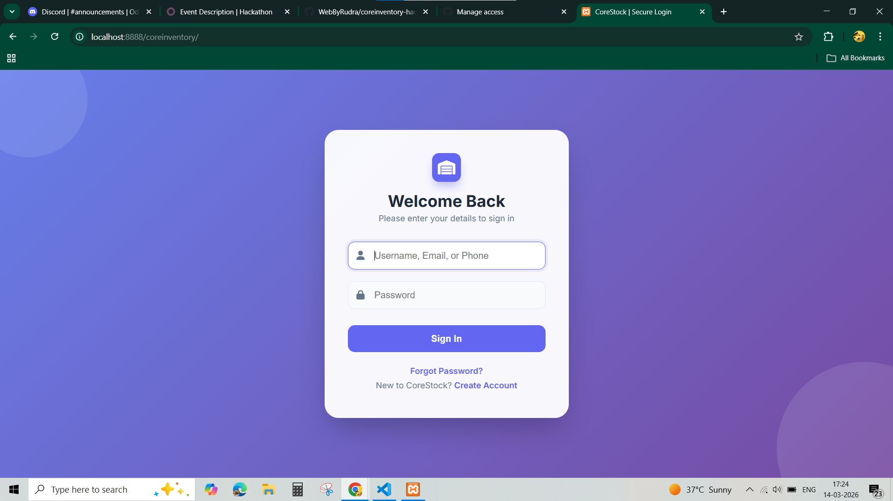
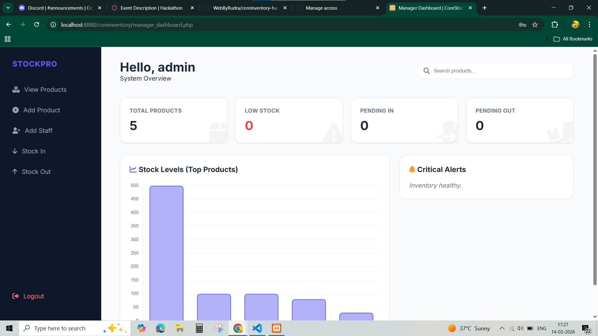
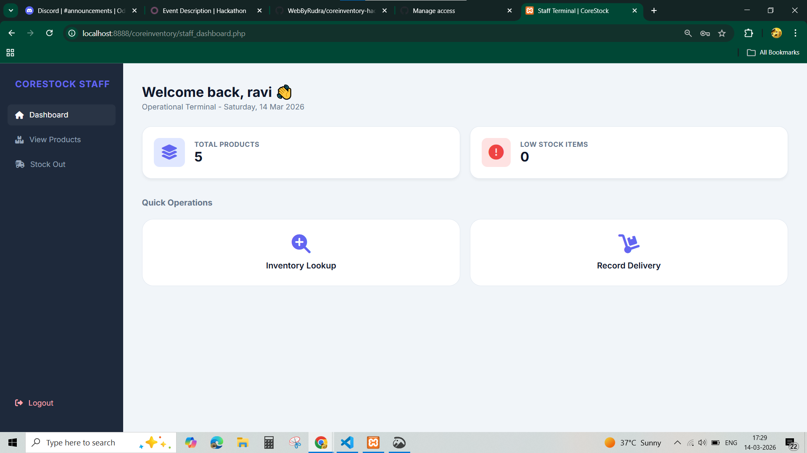
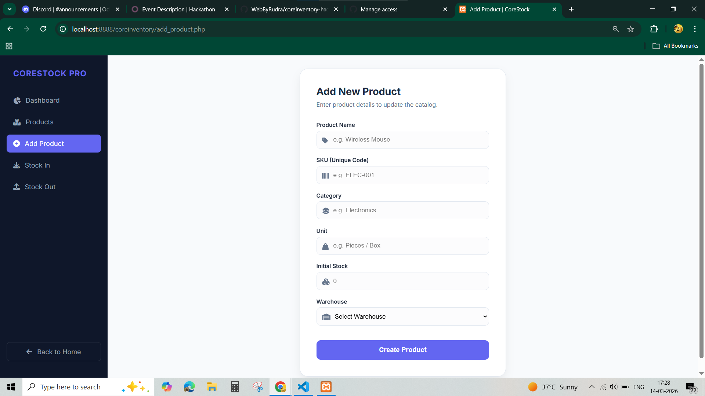
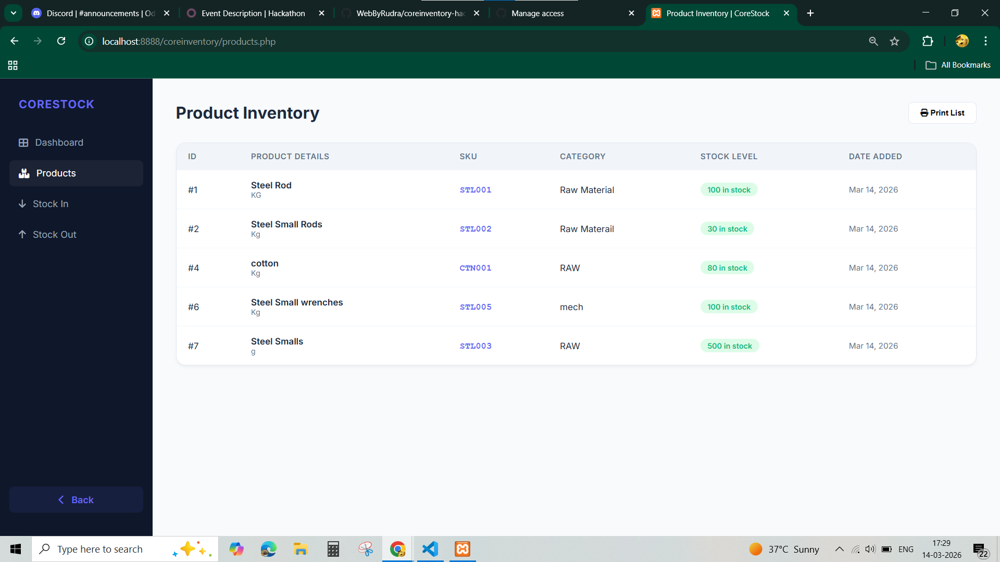
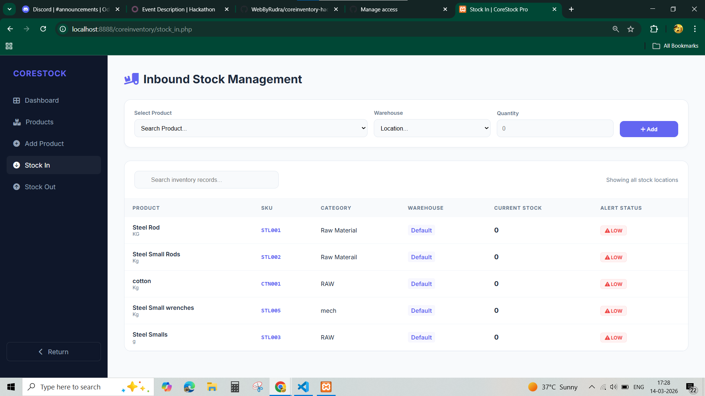
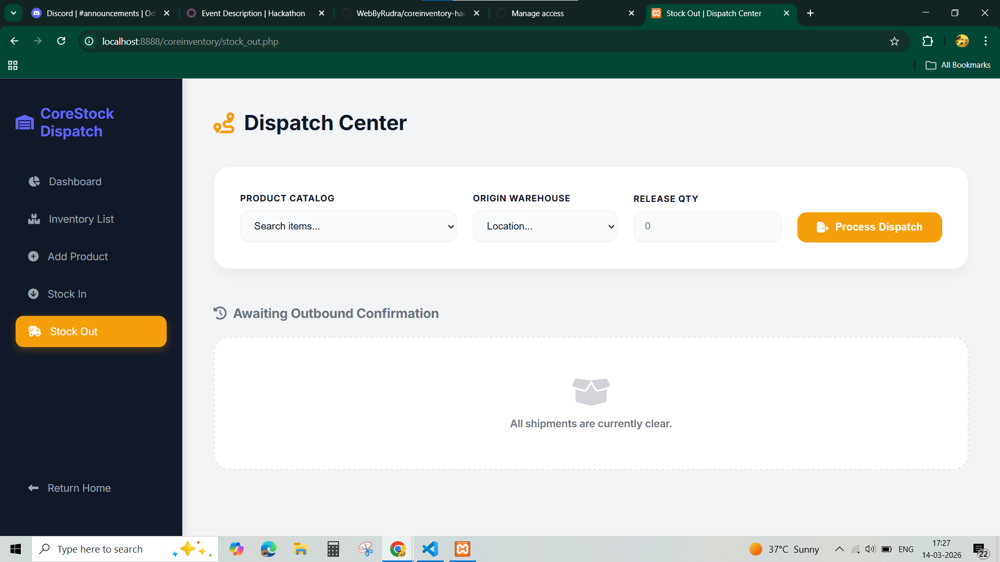

# CoreInventory Hackathon Project – CoreStock

## 🏢 Project Overview
**CoreStock** is a full-stack Inventory Management System built to help businesses track products, manage stock, and monitor inventory levels in real-time.

✅ Role-based login (Manager & Staff)  
✅ Dashboard with KPIs  
✅ Product management with Warehouse info  
✅ Stock In / Stock Out  
✅ Transaction history  
✅ Low stock alerts  

---

## 💻 Technology Stack
- **Backend:** PHP  
- **Database:** MySQL  
- **Frontend:** HTML, CSS, JavaScript  
- **Environment:** XAMPP / Localhost  

---

## 📸 Screenshots

### 1. Login Page


### 2. Manager Dashboard


### 3. Staff Dashboard


### 4. Add Product (with Warehouse)


### 5. Products Table (showing Warehouse)


### 6. Stock In / Stock Out



### 7. Transaction History


### 8. Low Stock Alert


---

## 🚀 Features
- **Role-based Access:** Manager vs Staff  
- **Dashboard KPIs:** Quick insights of inventory  
- **Product Management:** Add, update, delete products with Warehouse info  
- **Stock Control:** Stock In, Stock Out with validation  
- **Transaction History:** Track all stock movements  
- **Low Stock Alerts:** Visual indicators for restock  

---

## 🎥 Demo Video
 

---

## 📂 Setup Instructions
1. Clone the repository:  
   ```bash
   git clone https://github.com/WebByRudra/coreinventory-hackathon.git